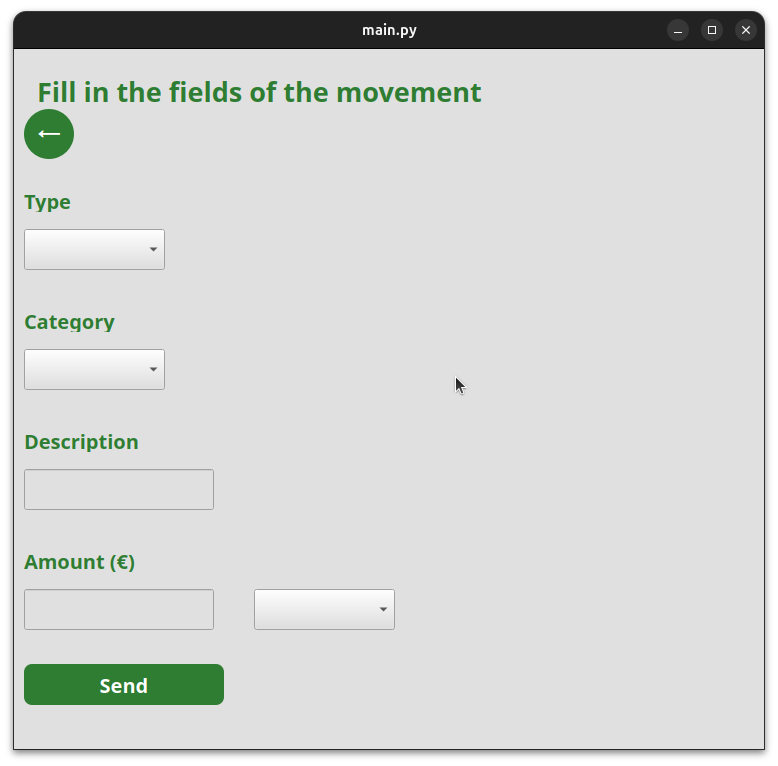

<h1 style="color: green">Budget Planner</h1>

A GUI that allows you to manage both your income and expenses of your daily life. With this tool, you will be able to identify where you are spending your money and from this, make a better financial strategy.

This has 3 main options:

1. Enter a movement: Register a transaction by assigning a description, category and payment method.

2. Money distribution: To check the balances of the different registered payment methods.
  
Also, you are able to add or remove a payment method or a specific institution in the Card section by using the buttons below: Add Holding and Remove Holding.

3. Expense summary: It displays the data associated with the monthly expenses in tabular form.